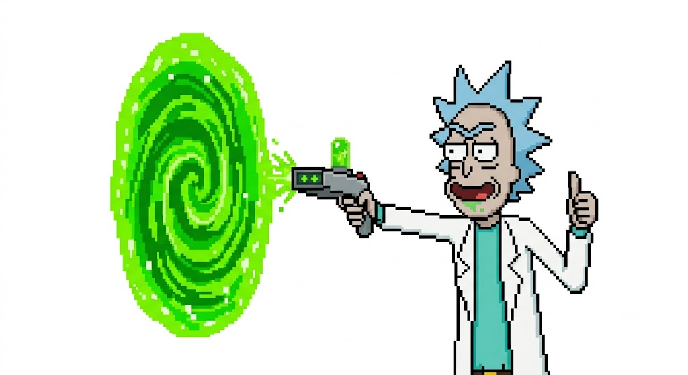
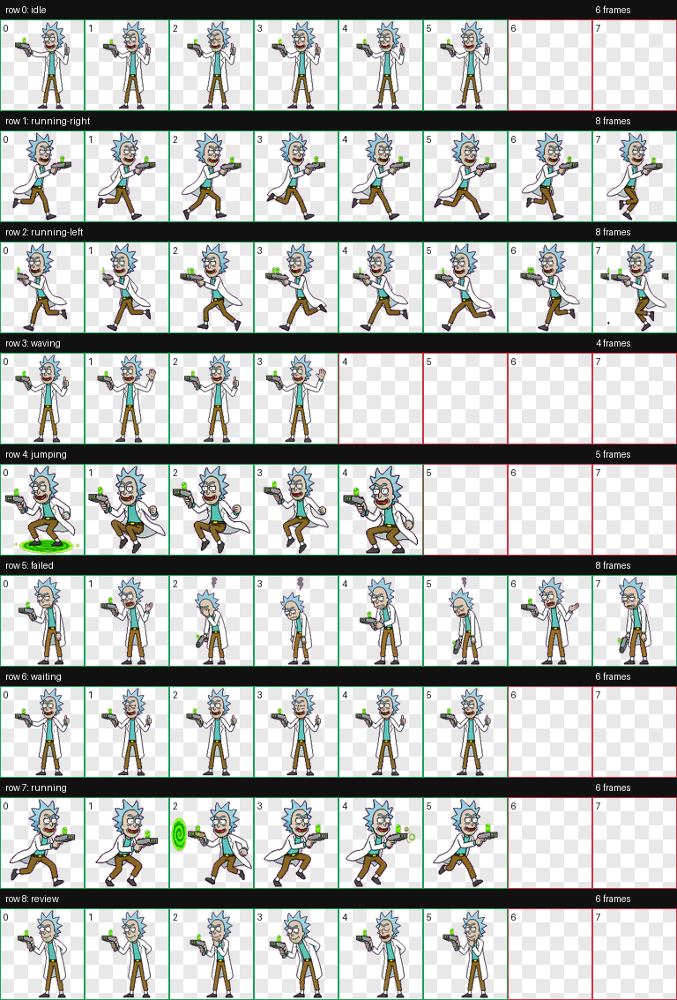

# Codex 自定义 Pet 实战：把默认宠物换成 Rick

很多人第一次打开 Codex，都会先注意到右下角那个会动的小宠物。这个功能本身很好玩，但如果你对界面风格、角色气质或者极客感有要求，自带 Pet 往往不够“对味”。

那咱们如何把 Codex 的默认 Pet 换成一个基于《Rick and Morty》里 Rick 形象的自定义 Pet，并最终安装到本地 Codex 中使用。

先看最终效果：


## 1. 先确认 Codex 支持什么

根据 Codex 手册，Codex Pet 的入口在：

- `Settings -> Appearance -> Pets`

这里可以做两件事：

- 选择内置宠物
- 刷新本地自定义宠物

也就是说，Codex 本身已经支持从本地目录读取你自己制作的 Pet，不需要手改前端资源包。

## 2. 这次最终做出来的是什么

这次实际完成的 Pet 是一个名为 `Rick Portal` 的自定义宠物，已经安装在本机：

```text
~/.codex/pets/rick-portal
```

其中核心文件只有两个：

```text
~/.codex/pets/rick-portal/pet.json
~/.codex/pets/rick-portal/spritesheet.webp
```

对应的 `pet.json` 内容很简单：

```json
{
  "id": "rick-portal",
  "displayName": "Rick Portal",
  "description": "A Codex pet based directly on the provided pixel-art Rick with portal gun and green portal.",
  "spritesheetPath": "spritesheet.webp"
}
```

也就是说，真正的重点不是配置文件，而是把一整套动画状态整理成 Codex 能识别的精灵图。

## 3. 先安装制作 Pet 的技能

这次用到的是 Codex 的 `hatch-pet` 技能。它不是默认每个环境都带，所以第一步是先装上。

实际安装命令如下：

```bash
python3 /Users/niuma/.codex/skills/.system/skill-installer/scripts/install-skill-from-github.py \
  --repo openai/skills \
  --path skills/.curated/hatch-pet \
  --method git
```

安装完成后，建议重启一次 Codex，让技能索引刷新到最新状态。

## 4. 不要一开始就写 Prompt，先定参考图

如果你只是写一句“帮我生成一个 Rick 风格的宠物”，最后出来的结果大概率只会“像”，但不会“准”。

这次真正稳定产出的关键，不是长 Prompt，而是建议先锁定参考图，再围绕参考图生成不同状态。

本次使用的参考图如下：



这张图有几个好处：

- 让GPT5.5 生成会出发安全审查，涉及版权绘阻碍你完成
- 角色识别度高，Rick 的头发、脸型、白大褂和传送枪都很完整
- 已经是像素风，天然适合 Pet 精灵图二次加工
- 左侧绿色传送门直接定义了这个角色的主题元素

如果你也想做类似角色，我建议优先准备这种“单角色、透明或纯背景、姿态清晰”的参考图，而不是复杂场景图。

## 5. 实际制作流程：从参考图到可安装 Pet

这次最终使用的工作目录是：

```text
/Users/niuma/Documents/Pet/tmp/rick-portal-run
```

整个流程可以理解成 5 步。

### 第一步：准备一次 Pet Run

`hatch-pet` 会先创建一个完整的运行目录，里面包含：

- `pet_request.json`
- `imagegen-jobs.json`
- 每个动作状态对应的 prompt
- 参考图目录
- 最终合成和验证目录

在这次工作流里，核心思路是：

- 用参考图先确定 Rick 的基础形象
- 再派生出 `idle`、`running-right`、`running-left`、`waving`、`jumping`、`failed`、`waiting`、`running`、`review` 等状态

换句话说，Pet 不是“生成一张图”就结束，而是生成一个完整的 9 状态动画集合。

### 第二步：锁定 canonical base

真正决定角色一致性的，是基础形象图，也就是 canonical base。

这次产出的基准图被保存在：

```text
/Users/niuma/Documents/Pet/tmp/rick-portal-run/references/canonical-base.png
```

后面所有状态都要围绕这个基础形象展开。这样做的好处是：

- 每一帧不会越画越偏
- Rick 的头发、五官、服装和比例能保持一致
- 传送门元素只在需要的状态中出现，不会全状态乱飞

### 第三步：生成各个动画状态

这次 Pet 最终保留的设计方向是：

- `idle`：静止状态，Rick 保持人物识别度
- `running-right` / `running-left`：移动状态
- `waving`：有一点互动感
- `jumping`：跳跃状态
- `failed`：失败或报错时的状态
- `waiting`：等待状态
- `running`：Codex 正在处理任务时的状态
- `review`：偏审视、思考的状态

用户一开始其实提过更复杂的想法，比如：

- 闲置时喝小酒
- 思考时摆弄黑科技设备
- 成功时打传送枪
- 失败时做夸张动作

但最终落地时做了一个很重要的取舍：**保留 Rick 本体的一致性，把传送门作为局部动作元素，而不是把每个状态都做成大特效。**

这么做的原因很简单：

- Pet 在 Codex 里显示尺寸不大
- 特效太多会抢掉角色本体
- 真正最重要的是“一眼认出这就是 Rick”

### 第四步：合成精灵图并验证

所有状态生成完成后，需要把逐帧结果整理成最终 spritesheet。

最终产物在：

```text
/Users/niuma/Documents/Pet/tmp/rick-portal-run/final/spritesheet.webp
```

这次验证结果显示：

```json
{
  "ok": true,
  "format": "WEBP",
  "mode": "RGBA",
  "width": 1536,
  "height": 1872,
  "transparent_rgb_residue_pixels": 0,
  "errors": [],
  "warnings": []
}
```

几个关键点可以直接看出这份 Pet 是合格的：

- `ok: true`
- 没有 `errors`
- 没有 `warnings`
- 透明背景残留像素为 `0`

这一步很重要，因为很多自定义 Pet 失败，并不是“生成得不好看”，而是 atlas 格式、透明背景或者帧布局不符合 Codex 规范。

### 第五步：做一次可视化 QA

除了验证 JSON，这次还额外生成了一张总览图：



这张图对应的是所有状态拼出来的 contact sheet，作用很直接：

- 快速检查 Rick 的角色一致性
- 看传送门元素有没有喧宾夺主
- 看某些状态是否和语义不匹配
- 看是否存在裁切、偏移、残影等问题

如果你自己做 Pet，这一步不要省。

## 6. 最后怎么装进 Codex

当 `spritesheet.webp` 和 `pet.json` 都准备好之后，把它们放到：

```text
~/.codex/pets/rick-portal
```

然后回到 Codex：

1. 打开 `Settings`
2. 进入 `Appearance`
3. 找到 `Pets`
4. 点击刷新本地自定义宠物
5. 选择 `Rick Portal`

如果刷新后没有立刻看到，可以：

- 重启 Codex
- 再执行一次刷新
- 检查当前 `CODEX_HOME` 是否和你实际写入的目录一致

## 7. 这次流程里几个比较关键的经验

### 1. 先有参考图，再谈 Prompt

如果角色识别度要求高，参考图的重要性远高于堆 Prompt 词。

### 2. 把角色一致性放在特效前面

这类桌面宠物的显示尺寸很小，真正影响观感的是：

- 脸是否稳定
- 头发和服装是否统一
- 动作是否一眼能看懂

不是粒子越多越好，也不是传送门越大越酷。

### 3. 一定要看最终 atlas 和 contact sheet

只看单张图，很容易误判。

只有把所有状态放在一起看，你才知道这个 Pet 是否真的“像同一个角色”。

### 4. 安装路径要确认到位

这次最终安装目录是：

```text
~/.codex/pets/rick-portal
```

如果你文件明明生成了，但 Codex 里刷新不到，先检查：

```bash
echo $CODEX_HOME
```

如果 `CODEX_HOME` 指向了别的目录，那你可能是把 Pet 装到错地方了。

## 8. 一份最小可复现清单

如果你只想抓重点，可以直接按下面这个顺序走：

1. 安装 `hatch-pet`
2. 准备一张高识别度的角色参考图
3. 创建一次新的 pet run
4. 锁定 canonical base
5. 生成 9 个状态
6. 合成 `spritesheet.webp`
7. 验证 atlas 合规
8. 把 `pet.json` 和 `spritesheet.webp` 放进 `~/.codex/pets/<pet-id>`
9. 在 `Settings -> Appearance -> Pets` 中刷新并选择

## 9. 总结

Codex 的 Pet 系统本质上不是一个“换头像”功能，而是一套完整的本地自定义动画宠物机制。只要你掌握了参考图、状态设计、精灵图合成和本地安装这几个关键点，就可以把默认 Pet 换成更符合自己审美和工作气质的角色。

这次用 Rick 来做的原因也很直接：角色辨识度高、科技感强、动作语言明确，而且和 Codex 这种开发工具的气质很搭。

如果你已经对默认 Pet 无感，这条路值得折腾一次。
